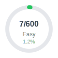
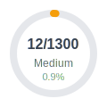
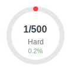

# 📊 Enhanced Dashboard Implementation ✅ COMPLETE

## 🎯 Goal ✅ ACHIEVED
Create a comprehensive dashboard with multiple chart types that automatically update and display in the main README.

## 🚀 **What's Been Built**

### **Dashboard Components:**
✅ **Circular Progress Bars** - Easy/Medium/Hard difficulty progress  
✅ **Topic Mastery Chart** - Horizontal bars showing algorithm pattern coverage  
✅ **Language Coverage Chart** - Multi-language support visualization  
✅ **Status Breakdown Donut** - Complete vs Solutions Only problems  
✅ **Activity Heatmap** - GitHub-style contribution graph  
✅ **Auto-updating** - GitHub Actions integration

---

## 🔧 Simple Implementation (1-2 hours)

### **Step 1: Python Script to Generate Progress Bars**

Create `dashboard/scripts/generate_progress.py`:

```python
#!/usr/bin/env python3
"""Generate SVG progress bars for LeetCode problems"""

import os
import json
from pathlib import Path

def count_problems():
    """Count problems by difficulty"""
    problems_dir = Path("problems")
    
    counts = {
        "easy": 0,
        "medium": 0, 
        "hard": 0
    }
    
    # Count easy problems
    easy_dir = problems_dir / "1-easy"
    if easy_dir.exists():
        counts["easy"] = len([d for d in easy_dir.iterdir() if d.is_dir()])
    
    # Count medium problems  
    medium_dir = problems_dir / "2-medium"
    if medium_dir.exists():
        counts["medium"] = len([d for d in medium_dir.iterdir() if d.is_dir()])
    
    # Count hard problems
    hard_dir = problems_dir / "3-hard" 
    if hard_dir.exists():
        counts["hard"] = len([d for d in hard_dir.iterdir() if d.is_dir()])
    
    return counts

def generate_progress_svg(solved, total, color, label):
    """Generate SVG for circular progress bar"""
    
    if total == 0:
        percentage = 0
    else:
        percentage = (solved / total) * 100
    
    # Calculate stroke-dasharray for progress circle
    circumference = 2 * 3.14159 * 45  # radius = 45
    stroke_dasharray = circumference
    stroke_dashoffset = circumference - (percentage / 100) * circumference
    
    svg = f'''<svg width="120" height="120" viewBox="0 0 120 120" xmlns="http://www.w3.org/2000/svg">
  <!-- Background circle -->
  <circle cx="60" cy="60" r="45" fill="none" stroke="#e5e7eb" stroke-width="8"/>
  
  <!-- Progress circle -->
  <circle cx="60" cy="60" r="45" fill="none" stroke="{color}" stroke-width="8"
          stroke-dasharray="{stroke_dasharray}" 
          stroke-dashoffset="{stroke_dashoffset}"
          stroke-linecap="round"
          transform="rotate(-90 60 60)"/>
  
  <!-- Center text -->
  <text x="60" y="55" text-anchor="middle" font-family="Arial, sans-serif" font-size="16" font-weight="bold" fill="#374151">
    {solved}/{total}
  </text>
  <text x="60" y="75" text-anchor="middle" font-family="Arial, sans-serif" font-size="12" fill="#6b7280">
    {label}
  </text>
  <text x="60" y="90" text-anchor="middle" font-family="Arial, sans-serif" font-size="11" fill="#9ca3af">
    {percentage:.1f}%
  </text>
</svg>'''
    
    return svg

def main():
    """Generate all progress bar SVGs"""
    
    # Count current problems
    counts = count_problems()
    
    # LeetCode totals (approximate)
    totals = {
        "easy": 600,
        "medium": 1300, 
        "hard": 500
    }
    
    colors = {
        "easy": "#22c55e",     # Green
        "medium": "#f59e0b",   # Orange  
        "hard": "#ef4444"      # Red
    }
    
    labels = {
        "easy": "Easy",
        "medium": "Medium",
        "hard": "Hard"
    }
    
         # Create dashboard assets directory
     assets_dir = Path("dashboard/assets")
     assets_dir.mkdir(exist_ok=True)
    
    # Generate SVGs
    for difficulty in ["easy", "medium", "hard"]:
        solved = counts[difficulty]
        total = totals[difficulty] 
        color = colors[difficulty]
        label = labels[difficulty]
        
        svg_content = generate_progress_svg(solved, total, color, label)
        
        # Save SVG file
        svg_path = assets_dir / f"progress_{difficulty}.svg"
        with open(svg_path, "w") as f:
            f.write(svg_content)
        
        print(f"Generated {svg_path}")
    
    # Also generate a combined stats file
    stats = {
        "counts": counts,
        "totals": totals,
        "last_updated": "Generated automatically"
    }
    
    with open(assets_dir / "progress_stats.json", "w") as f:
        json.dump(stats, f, indent=2)
    
    print("Progress bars generated successfully!")

if __name__ == "__main__":
    main()
```

### **Step 2: Update Main README**

Add this section to the main `README.md` after the directory structure:

```markdown
## 📊 Progress Overview

<div align="center">
  <table>
    <tr>
           <td align="center">
       
     </td>
     <td align="center">
       
     </td>
     <td align="center">
       
     </td>
    </tr>
  </table>
</div>

**Total Progress: 20 problems solved**

---
```

### **Step 3: GitHub Action for Auto-Updates**

Create `.github/workflows/update-progress.yml`:

```yaml
name: Update Progress Bars

on:
  push:
    branches: [main]
    paths: ['problems/**']
  workflow_dispatch: # Allow manual trigger

jobs:
  update-progress:
    runs-on: ubuntu-latest
    
    steps:
      - uses: actions/checkout@v4
      
      - name: Set up Python
        uses: actions/setup-python@v5
        with:
          python-version: '3.11'
      
             - name: Generate progress bars
         run: python dashboard/scripts/generate_progress.py
      
      - name: Commit progress bar updates
        run: |
          git config --local user.email "action@github.com" 
          git config --local user.name "GitHub Action"
          
                     if [ -n "$(git status --porcelain)" ]; then
             git add dashboard/assets/
             git commit -m "📊 Update progress bars [skip ci]"
            git push
          else
            echo "No changes to commit"
          fi
        env:
          GITHUB_TOKEN: ${{ secrets.GITHUB_TOKEN }}
```

---

## 🚀 Quick Setup Instructions

### **1. Create the script** (2 minutes)
```bash
mkdir -p dashboard/scripts
# Copy the Python script above to dashboard/scripts/generate_progress.py
chmod +x dashboard/scripts/generate_progress.py
```

### **2. Generate initial progress bars** (1 minute)
```bash
python dashboard/scripts/generate_progress.py
```

### **3. Update README** (2 minutes)
Add the progress overview section to your main README.md

### **4. Add GitHub Action** (1 minute)
```bash
mkdir -p .github/workflows
# Copy the YAML above to .github/workflows/update-progress.yml
```

### **5. Commit and push** (1 minute)
```bash
git add .
git commit -m "Add progress bars"
git push
```

---

## 🎨 Result

You'll get beautiful circular progress bars that show:
- **7/600 Easy** (1.2%) in green
- **12/1300 Medium** (0.9%) in orange  
- **1/500 Hard** (0.2%) in red

### Example Output:
```
📊 Progress Overview

[🟢 7/600 Easy 1.2%] [🟡 12/1300 Medium 0.9%] [🔴 1/500 Hard 0.2%]

Total Progress: 20 problems solved
```

---

## 🔄 How It Works

1. **Script runs** when you add new problems to the `problems/` folder
2. **Counts problems** automatically by scanning directories
3. **Generates SVGs** with the current progress
4. **Updates README** automatically via GitHub Actions
5. **No maintenance** required - it just works!

---

## 🎯 Future Enhancements (Optional)

If you want to extend this later:

### **Add topics breakdown:**
```python
def generate_topic_progress():
    topics = {"arrays": 5, "strings": 3, "trees": 2}
    # Generate topic-specific progress bars
```

### **Add streak tracking:**
```python
def calculate_streak():
    # Parse git commits to find solving streak
    return streak_days
```

### **Add monthly goals:**
```python
def check_monthly_goals():
    # Track progress toward monthly solving goals
    return goal_progress
```

---

## ✅ Total Time Investment

- **Setup**: 5-10 minutes
- **Maintenance**: 0 minutes (automatic)
- **Result**: Professional-looking progress tracking

This gives you immediate visual feedback in your README that updates automatically whenever you add new problems!